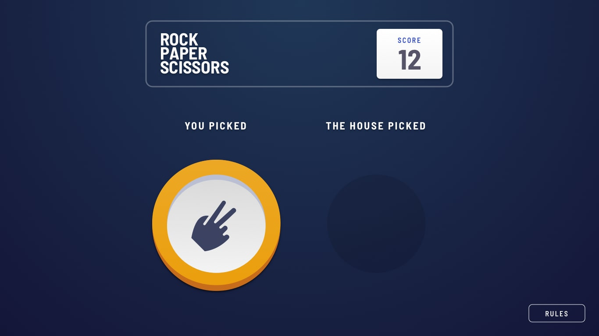

# Frontend Mentor - Space tourism website solution

This is a solution to the [Space tourism website challenge on Frontend Mentor](https://www.frontendmentor.io/challenges/space-tourism-multipage-website-gRWj1URZ3).

## Table of contents

-   [Overview](#overview)
    -   [The challenge](#the-challenge)
    -   [Screenshot](#screenshot)
    -   [Links](#links)
-   [My process](#my-process)
    -   [Built with](#built-with)
    -   [What I learned](#what-i-learned)
    -   [Continued development](#continued-development)
    -   [Useful resources](#useful-resources)
-   [Author](#author)
-   [Acknowledgments](#acknowledgments)

## Overview

### The challenge

Users should be able to:

-   View the optimal layout for the game depending on their device's screen size
-   Play Rock, Paper, Scissors against the computer
-   Maintain the state of the score after refreshing the browser

### Screenshot





### Links

-   [Solution URL]()
-   [Live Site URL]()

## My process

### Built with

-   Semantic HTML5 markup
-   CSS custom properties
-   Flexbox
-   CSS Grid
-   Mobile-first workflow
-   A11y & aria Standards
-   BEM
-   Sass
-   Gsap

### What I learned

This project was built with the aim of experimenting with using gsap to do all the project animations, And try to program a solid code that is easy to modify and improve in the future in order to facilitate the addition of new features to the game

-   BEM naming system

```html
<div class="hero__item--rock linear-gradient hero__item"></div>
```

-   linear gradient with a one util class

```css
.linear-gradient {
	--deg: 180deg;
	--grad2-deg: 100%;
	--grad1-deg: 0%;
	--grad2-clr: ;
	--grad1-clr: ;
	background: var(--grad1-clr);
	background: linear-gradient(
		var(--deg),
		var(--grad1-clr) var(--grad1-deg),
		var(--grad2-clr) var(--grad2-deg)
	);
}
.hero__item--rock.linear-gradient {
	--grad2-clr: var(--clr-red-800);
	--grad1-clr: var(--clr-red-700);
	box-shadow: inset 0px -8px 0 var(--rock-shadow), 0px 0px 20px 10px hsl(0deg
					0% 0% / 20%);
}
```

-   Easy to modify container with css variables

```css
.Container {
	--container-width: 90%;
	height: 100%;
	width: var(--container-width, 90%);
	margin-inline: auto;
}
.main-header {
	.Container {
		--container-width: 75%;
	}
}
```

-   a to click button to use with an element that dose not look like a button but act like one

```css
.toClickButton {
	user-select: none;
	overflow: hidden;
	cursor: pointer;
	text-decoration: none;
	border: none;
	border-radius: var(--border-radius);
}
```

-   using an object to contain all variables

```js
let header = {
	body: document.querySelector(".main-header"),
	score: {
		button: document.querySelector(".score__button"),
		value: document.querySelector("#scoreValue"),
	},
};
```

-   get a random number between two numbers

```js
function housePicked() {
	let rand = Math.floor(Math.random() * Object.keys(game.items).length);
	return game.items[rand];
}
let house = housePicked();
```

-   a function that select a distinct element from a set of elements, and then apply something different to it than is applied to the rest of the elements

```js
function setSpecialThings(
	specialThings,
	fatherSons,
	specialThingsFunction,
	unSpecialThingsFunction
) {
	let specialThingsArr = Array.isArray(specialThings)
		? specialThings
		: [specialThings];

	let fatherSonsArr = Array.isArray(fatherSons) ? fatherSons : [fatherSons];

	for (let fatherSon = 0; fatherSon < fatherSonsArr.length; fatherSon++) {
		if (specialThingsArr.length == 1) {
			if (fatherSonsArr[fatherSon] == specialThingsArr[0]) {
				specialThingsFunction(fatherSonsArr[fatherSon]);
			} else if (fatherSonsArr[fatherSon] != specialThingsArr[0]) {
				unSpecialThingsFunction(fatherSonsArr[fatherSon]);
			}
		} else {
			let unSpecialElement = [];
			let match = false;
			for (let i = 0; i < specialThingsArr.length; i++) {
				if (specialThingsArr[i] == fatherSonsArr[fatherSon]) {
					match = true;
					break;
				}
			}
			if (!match) {
				unSpecialElement.push(fatherSonsArr[fatherSon]);
			}
			specialThingsArr.forEach((specialThing) => {
				specialThingsFunction(specialThing);
			});
			unSpecialElement.forEach((unSpecial) => {
				unSpecialThingsFunction(unSpecial);
			});
		}
	}
}
```

### Continued development

-   using the Json file more
-   using React
-   A11y & aria Standards
-   Gsap & gsap ScrollTrigger

### Useful resources

Check out my latest previous articles:

-   [how to make an Indestructible button?](https://dev.to/ymhaah/how-to-make-an-indestructible-button-3f2h)
-   [Top 5 Icon websites for devs and designers!!!](https://dev.to/ymhaah/top-5-icon-websites-for-devs-and-designers-53mh)
-   [30-Day React Learning Journey!](https://dev.to/ymhaah/series/20473)

## Author

-   professional links:
    -   [Twitter](https://twitter.com/hafanwi)
    -   [LinkedIn](https://www.linkedin.com/in/youssef-hafnawy/)
    -   [GitHub](https://github.com/ymhaah)
-   Hire me:
    -   [UpWork](https://www.upwork.com/services/product/development-it-a-custom-and-responsive-websites-in-wordpress-1577236892828233728?ref=project_share)
    -   [Freelancer](https://freelancer.com/u/ymhaah)
-   Blog:
    -   [HashNode](https://hafnawi.hashnode.dev/)
    -   [Dev.to](https://dev.to/ymhaah)
    -   [Medium](https://medium.com/@ymhaah250)
